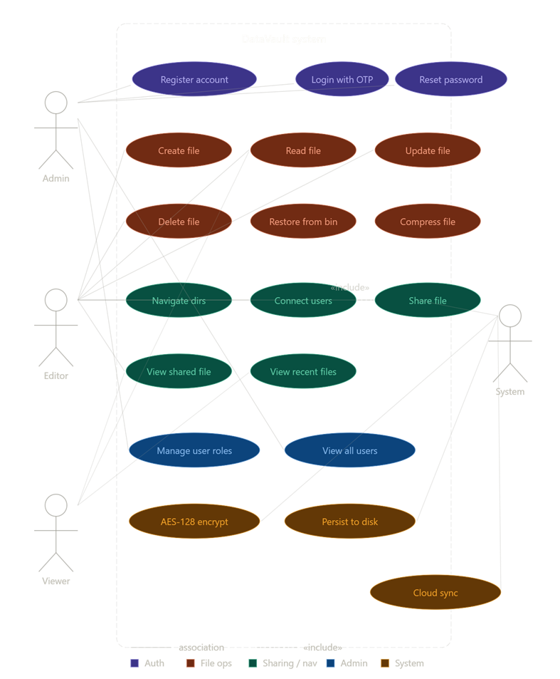
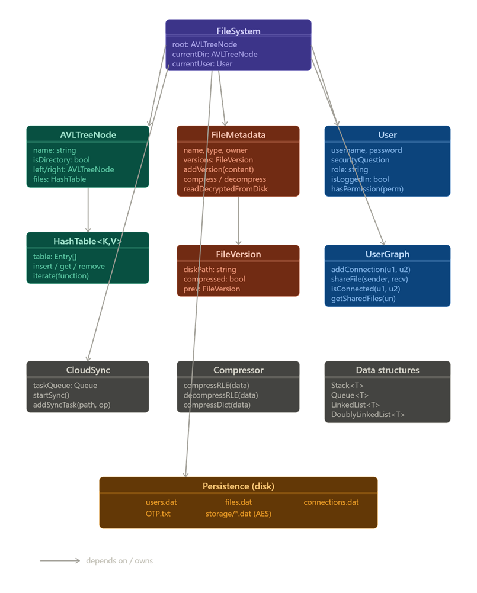
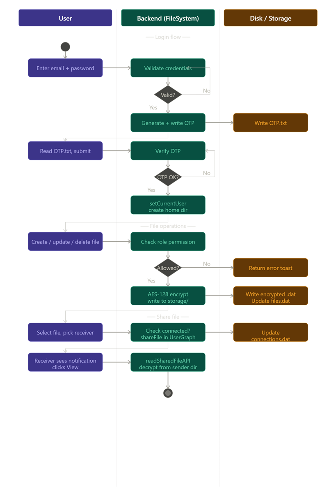

# DataVault

A secure multi-user file storage system built in C++ with a browser-based frontend.

## Team
- Syed Shaheer Hasan (24K-2023)
- Syed Muhammad Ahsan (24K-2041)

## Course
CS2004 — Fundamentals of Software Engineering  
FAST-NUCES

## Features
- AES-128 encrypted file storage
- Two-factor authentication with OTP
- Role-based access control (Admin, Editor, Viewer)
- File sharing between connected users
- Directory management using custom AVL Tree
- File compression using RLE and Dictionary algorithms
- Recycle bin with restore functionality
- Full data persistence across server restarts

## System Diagrams

### Use Case Diagram

### Class Diagram

### Activity Diagram

## Project Files
| File | Description |
|---|---|
| proj.cpp | C++ backend server |
| datavault.html | Browser-based frontend |
| httplib.h | HTTP server library (cpp-httplib) |

## Requirements
- Windows 10 or Windows 11
- MSYS2 UCRT64 with GCC 15.2.0
- Modern browser — Chrome or Edge

## How to Compile and Run
**Step 1 — Compile:**
g++ proj.cpp -o datavault.exe -lws2_32 -std=c++17
**Step 2 — Run the server:**
./datavault.exe
**Step 3 — Open the frontend:**  
Double-click datavault.html in File Explorer

## Data Structures Used
- AVL Tree — directory hierarchy
- Hash Table — file and user storage
- Stack — recycle bin and AVL traversal
- Queue — recent files and sync tasks
- Doubly Linked List — file version history

## Architecture
Browser (datavault.html) communicates with C++ server (proj.cpp) 
on localhost:8080 via HTTP POST with JSON payloads.
